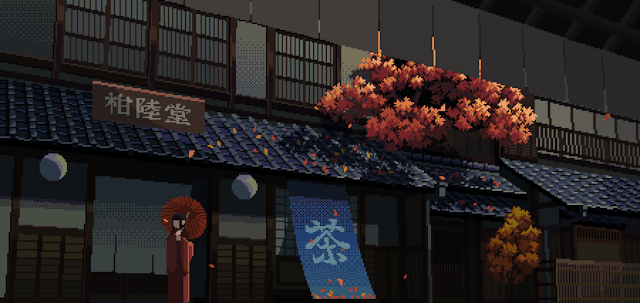

  

 

  

## 👋 Hi there! I'm Akshat Dwivedi

🚀 Full-stack .NET Developer at **Resolute AI Software Pvt. Ltd.** since January 2024  
🎓 Postgraduate & undergraduate from **Dr. Ram Manohar Lohia Avadh University**, Ayodhya (UP)  
💻 Passionate about building web, desktop, and mobile apps using technologies like:

- **React.js**, **Bootstrap 5**, **C#**, **.NET Core**, **.NET Framework**
- Writing clean, scalable code and delivering great user experiences

---

  

### 🧠 Skills Overview

#### 🖥️ Frontend

  
  
  
  
  

#### 🧰 Backend & Databases

  
  
  
  
  
  
  

#### ⚙️ DevOps & Cloud

  
  

---

  

### 📬 Connect with Me

| Platform    | Link |
|-------------|------|
| 🔗 **GitHub**     | [@i-m-akshat](https://github.com/i-m-akshat) |
| 💼 **LinkedIn**   | [@imakshatdwivedi](https://linkedin.com/in/imakshatdwivedi/) |
| 📷 **Instagram**  | [@i__m__akshat](https://instagram.com/i__m__akshat/) |

---

  

  
  
  

---

  

  

---

  

<table style="border: none; width: 100%;">
  <tr>
    <td style="width: 40%;">
      
    </td>
    <td style="width: 60%; vertical-align: top;">
      <h3>Thanks for stopping by! 🙏</h3>
      
If you liked my profile or work, feel free to connect or collaborate. I'm always up for building something fun and impactful. Let's create together! 🚀

    </td>
  </tr>
</table>

---

