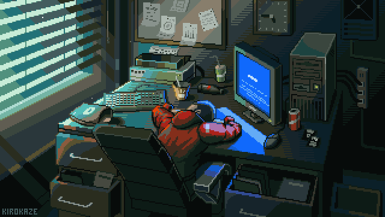
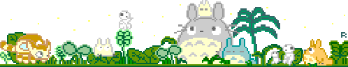

  <!--*/-->
  

   

  

  

<table style="border: none; width: 100%; max-width: 900px;">
  <tr>
    <td style="width: 40%; padding: 10px;">
      
    </td>
    <td style="width: 60%; padding: 20px;">
      <h2 style="color: #2c3e50; font-family: 'Segoe UI', Tahoma, Geneva, Verdana, sans-serif;">👋 Hi there! I'm Akshat Dwivedi, a full-time full-stack .NET developer</h2>
      

        🚀 Since January 2024, I’ve been contributing to innovative projects as a .NET developer at <strong>Resolute AI Software Pvt. Ltd.</strong> My academic foundation was built at <strong>Dr. Ram Manohar Lohia Avadh University</strong> in Ayodhya, UP, where I completed both my postgraduate and undergraduate studies.
      
 
      

        💻 I specialize in creating dynamic web, desktop, and mobile applications. My technical toolkit includes <strong>React.js</strong>, <strong>Bootstrap 5</strong>, <strong>C#</strong>, and the <strong>.NET Framework</strong>. I'm passionate about crafting clean and efficient code that drives seamless user experiences.
      

    </td>
  </tr>
</table>

   

  

  
<table>
  <tr>
    <td valign="top" width="33%">
     

  

 
     
  
  
  
  
  
  
  

    </td>
    <td align="top" width="33%">
       

  

 
    
  
  
  
  
  
  
  
  
  

    </td>
    <td valign="top" width="33%">
     

  

 
     
  
  
  

    </td>
  </tr>
</table>

   

    

<table style="width: 100%; border: none;">
  <tr>
    <td style="width: 40%; padding: 10px;">
      <!---->
      
    </td>
    <td style="width: 60%; padding: 20px;">
      

        <h3 style="margin-bottom: 5px;">GitHub</h3>
        
Check out my projects on GitHub. Feel free to explore, fork, and collaborate on code.

        
      

      

        <h3 style="margin-bottom: 5px;">LinkedIn</h3>
        
Connect with me on LinkedIn to stay updated on my professional journey, network, and exchange ideas.

        
      

      

        <h3 style="margin-bottom: 5px;">Instagram</h3>
        
Follow me on Instagram for a blend of my personal life and passion for drawing anime characters.

          
      

    </td>
  </tr>
</table>

 

  

  
<table style="border-style: none;">
  <tr>
    <td align="left">
     
    </td>
    <td align="center">
   
    </td>
      <td align="right">
  
    </td>
  </tr>
  <tr>
    <td align="center">
    </td>
  </tr>
</table>
   

  

  

   

  

  
<table style="border: none; width: 100%; max-width: 900px;">
  <tr>
    <td style="width: 40%; padding: 10px;">
      
    </td>
    <td style="width: 60%; padding: 20px;">
      <h2>Thank You for Visiting! 🙏</h2>

Hello! 👋

Thank you for taking the time to visit my GitHub profile. Your interest is greatly appreciated! I hope you find my repositories useful and interesting.

If you have any questions, feedback, or ideas for collaboration, please don’t hesitate to reach out. I’m always eager to connect with fellow developers and work on exciting projects.

Happy coding! 💻

Best regards, 
<strong>Akshat Dwivedi</strong>

    </td>
  </tr>
</table>
 

  

---
